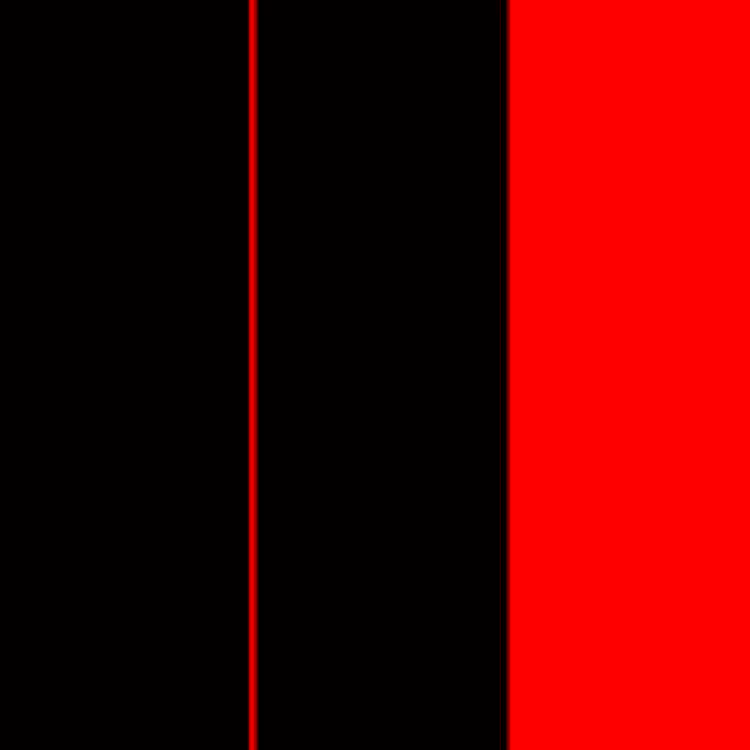
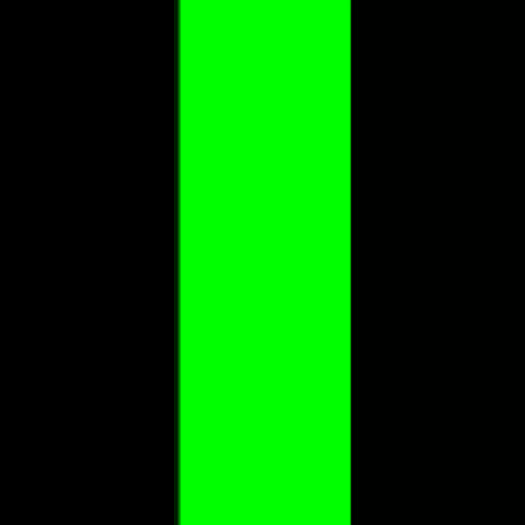
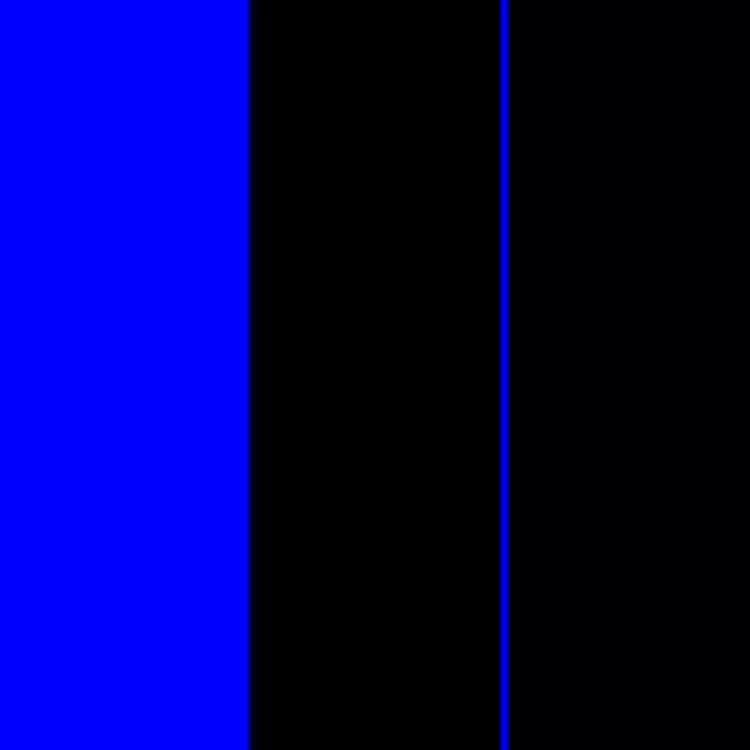
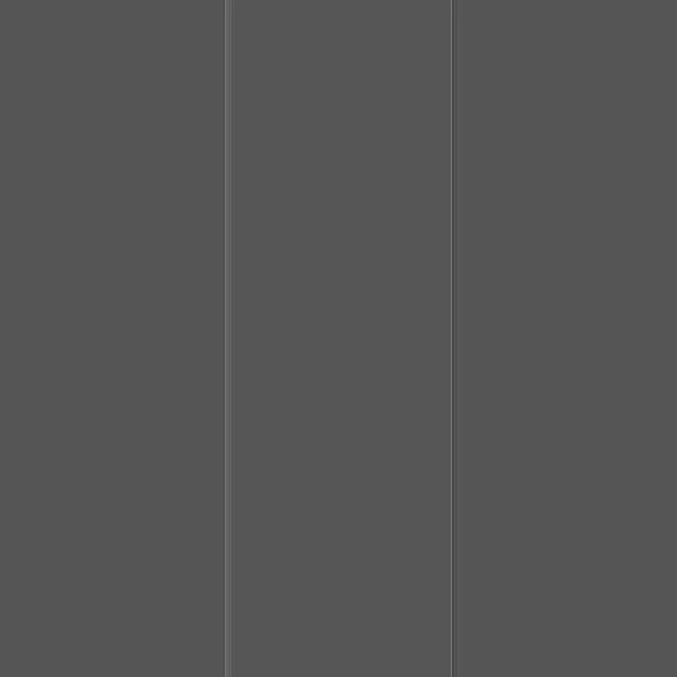
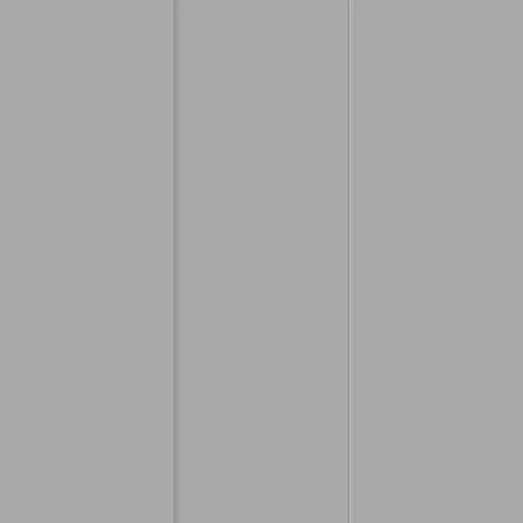
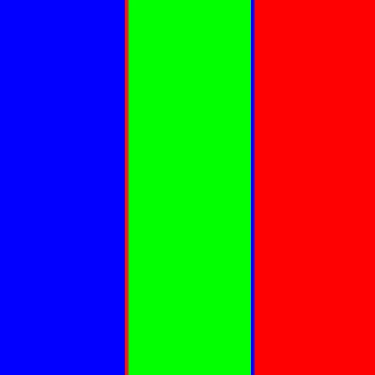
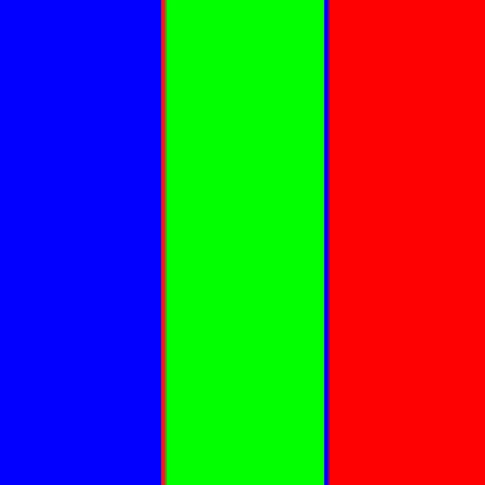
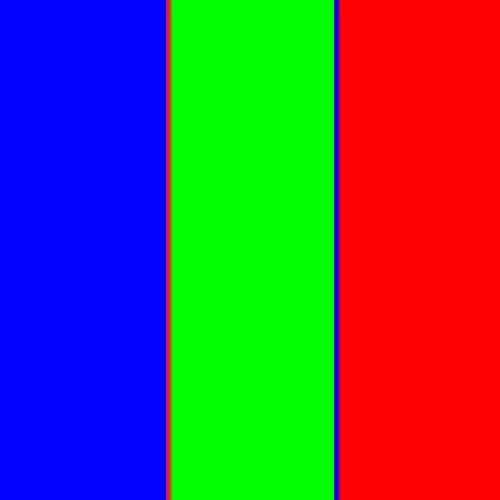

# Отчет по лабораторной работе

## 1. Выделение компонент R, G, B
Были разделены каналы изображения. Ниже представлены результаты:
- **Канал R:** 
- **Канал G:** 
- **Канал B:** 

## 2. Преобразование изображения в HSI
Ниже представлены компоненты:
- **Яркостная компонента (I):** 
- **Инвертированная яркостная компонента:** 

## 3. Изменение размера изображения

### 3.1 Изначальные размеры изображения
- **Размер изображения:** (750, 750)

### 3.2 Растяжение (интерполяция)
- **Коэффициент растяжения (M):** 3
- **Результат растяжения:** 
- **Размер изображения после растяжения:** (2250, 2250)

### 3.3 Сжатие (децимация)
- **Коэффициент сжатия (N):** 2
- **Результат сжатия:** 
- **Размер изображения после сжатия:** (375, 375)

### 3.4 Передискретизация в два прохода (растяжение + сжатие)
- **Коэффициент (K = M / N):** 1.5
- **Результат передискретизации в два прохода:** 
- **Размер изображения после передискретизации:** (1125, 1125)

### 3.5 Передискретизация в один проход
- **Коэффициент (K):** 1.5
- **Результат передискретизации в один проход:** 
- **Размер изображения после передискретизации:** (500, 500)
