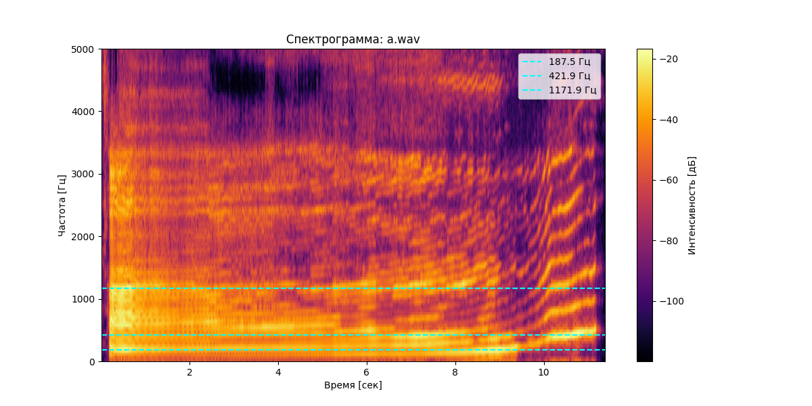
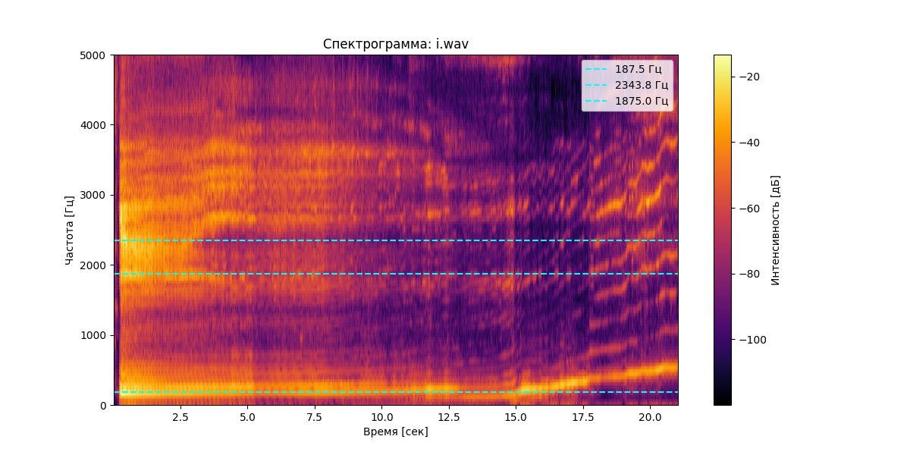
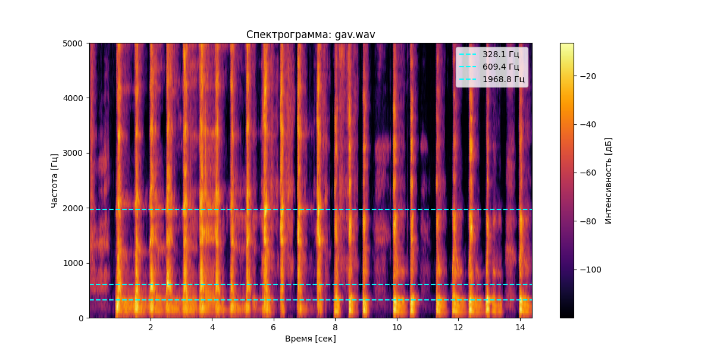

# Лабораторная работа №10: Обработка голоса

## Результаты анализа

### A (a.wav)
- Длительность: 11.40 сек
- Частотный диапазон: 0.0 – 3375.0 Гц
- Основной тон: 187.5 Гц
- Форманты: 187.5, 421.9, 1171.9 Гц
- 

### I (i.wav)
- Длительность: 21.06 сек
- Частотный диапазон: 140.6 – 3703.1 Гц
- Основной тон: 187.5 Гц
- Форманты: 187.5, 2343.8, 1875.0 Гц
- 

### BARK (gav.wav)
- Длительность: 14.40 сек
- Частотный диапазон: 93.8 – 4781.2 Гц
- Основной тон: 140.6 Гц
- Форманты: 328.1, 609.4, 1968.8 Гц
- 
