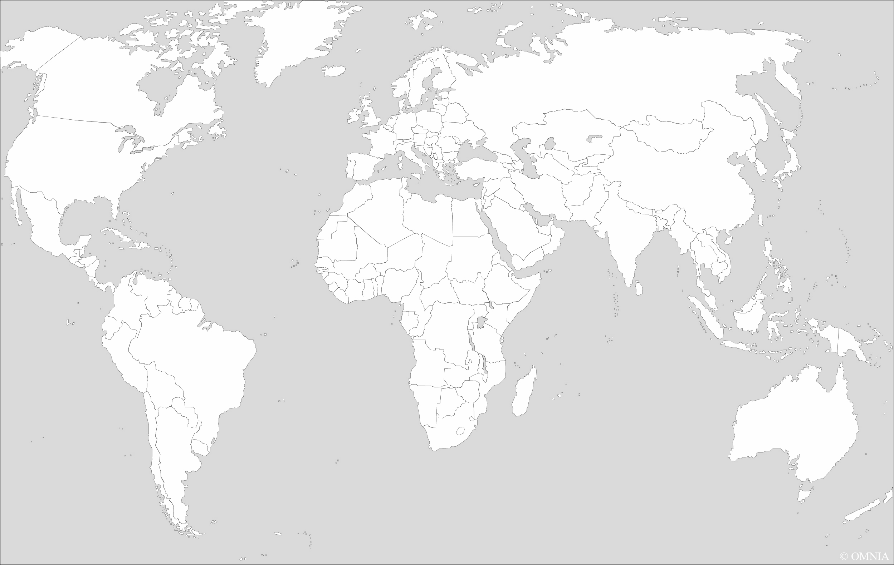

# Лабораторная работа №2: Обесцвечивание и бинаризация растровых изображений

## Задание 1: Приведение полноцветного изображения к полутоновому
Каждое изображение было преобразовано в полутоновое с использованием взвешенного усреднения каналов (R, G, B).

## Задание 2: Приведение полутонового изображения к монохромному
К каждому полутоновому изображению была применена адаптивная бинаризация методом Эйквила.

### Изображение: fingerprint.png

#### Исходное изображение

#### Полутоновое изображение

#### Бинаризованное изображение

### Изображение: map.png

#### Исходное изображение

#### Полутоновое изображение

#### Бинаризованное изображение

### Изображение: photo.png

#### Исходное изображение

#### Полутоновое изображение

#### Бинаризованное изображение

### Изображение: screenshot.png

#### Исходное изображение

#### Полутоновое изображение

#### Бинаризованное изображение

### Изображение: text.png

#### Исходное изображение

#### Полутоновое изображение

#### Бинаризованное изображение

### Изображение: x_ray.png

#### Исходное изображение

#### Полутоновое изображение

#### Бинаризованное изображение

## Выводы
1. Все изображения успешно преобразованы в полутоновые с использованием взвешенного усреднения каналов (R, G, B).
2. К полутоновым изображениям применена адаптивная бинаризация методом Эйквила, что позволило получить монохромные изображения.
3. Результаты работы сохранены в соответствующих файлах.
