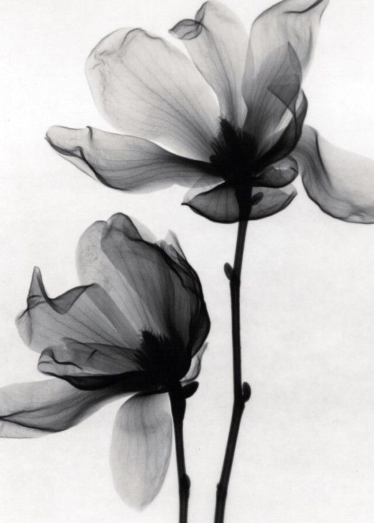

# Лабораторная работа №3: Фильтрация изображений и морфологические операции

## Задание 1: Медианный фильтр
К каждому изображению был применен медианный фильтр с разреженной маской (косой крест) и рангом 3/5.

## Задание 2: Разностное изображение
Для каждого изображения было вычислено разностное изображение (модуль разности между исходным и отфильтрованным изображением).

### Изображение: first_image.png

#### Исходное изображение

#### Отфильтрованное изображение

#### Разностное изображение

### Изображение: second_image.png

#### Исходное изображение

#### Отфильтрованное изображение

#### Разностное изображение

### Изображение: third_image.png

#### Исходное изображение

#### Отфильтрованное изображение

#### Разностное изображение

## Выводы
1. Медианный фильтр успешно применен ко всем изображениям. Он заменил значения пикселей на медиану в окрестности, заданной разреженной маской.
2. Разностное изображение показывает, какие пиксели были изменены фильтром.
3. Результаты работы сохранены в соответствующих файлах.
