# Лабораторная работа №5: Выделение признаков символов

## Задание 1: Генерация эталонных изображений символов
Были сгенерированы изображения символов русского алфавита (строчные курсивные буквы).

## Задание 2: Вычисление признаков
Для каждого символа были вычислены следующие признаки:
- Вес (масса чёрного) каждой четверти изображения.
- Удельный вес (вес, нормированный к четверти площади).
- Координаты центра тяжести.
- Нормированные координаты центра тяжести.
- Осевые моменты инерции по горизонтали и вертикали.
- Нормированные осевые моменты инерции.
- Профили X и Y.

## Результаты

### Символ: а

#### Изображение символа
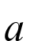

#### Профиль X
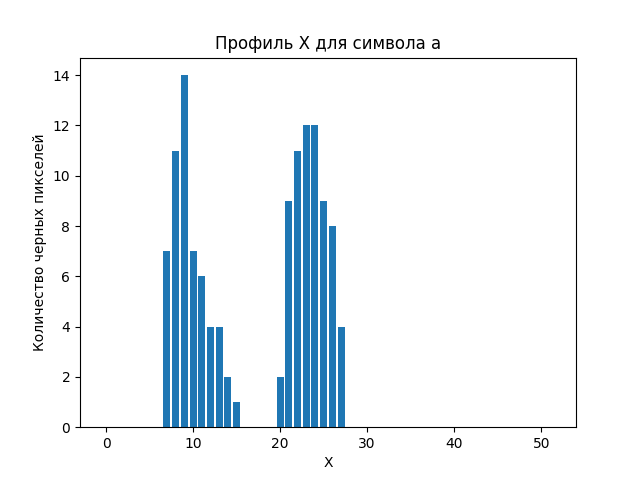

#### Профиль Y
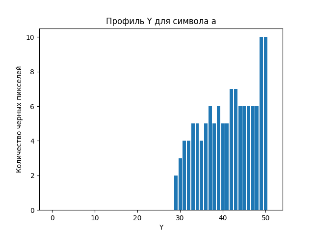

### Символ: б

#### Изображение символа
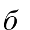

#### Профиль X
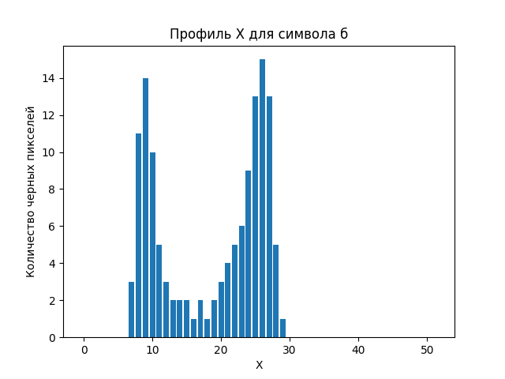

#### Профиль Y
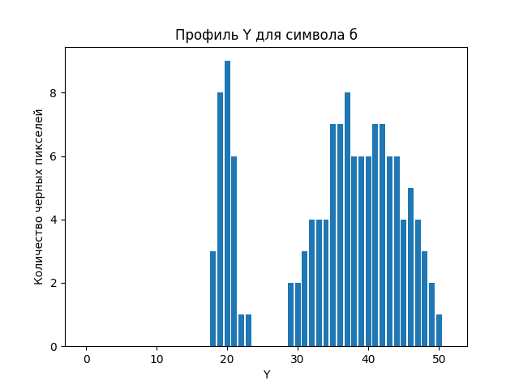

### Символ: в

#### Изображение символа
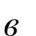

#### Профиль X
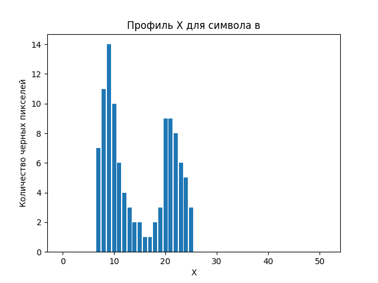

#### Профиль Y
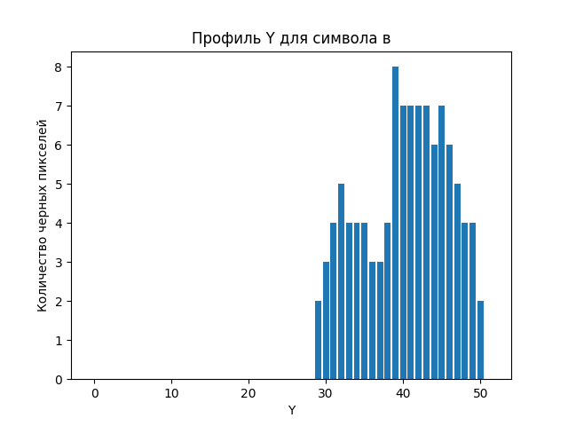

### Символ: г

#### Изображение символа
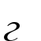

#### Профиль X
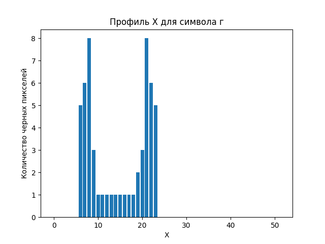

#### Профиль Y
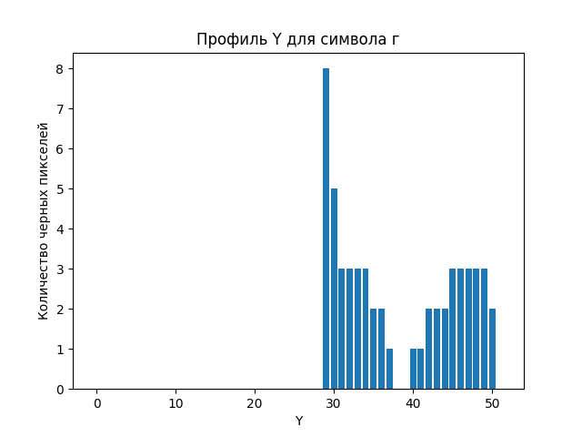

### Символ: д

#### Изображение символа
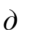

#### Профиль X
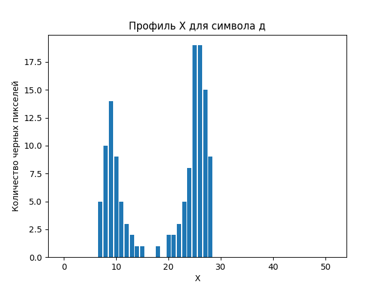

#### Профиль Y
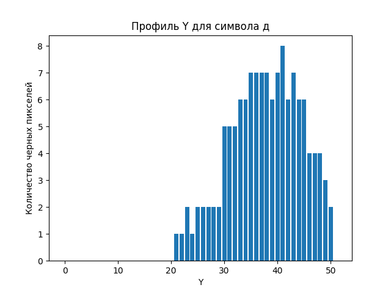

### Символ: е

#### Изображение символа
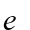

#### Профиль X
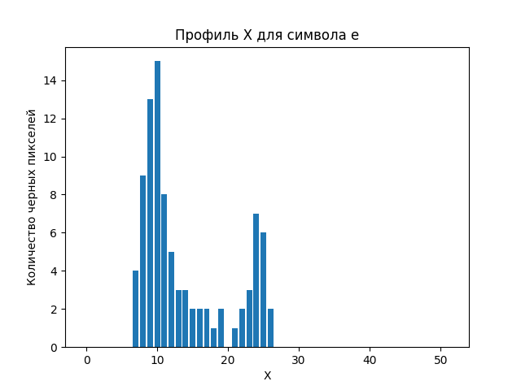

#### Профиль Y
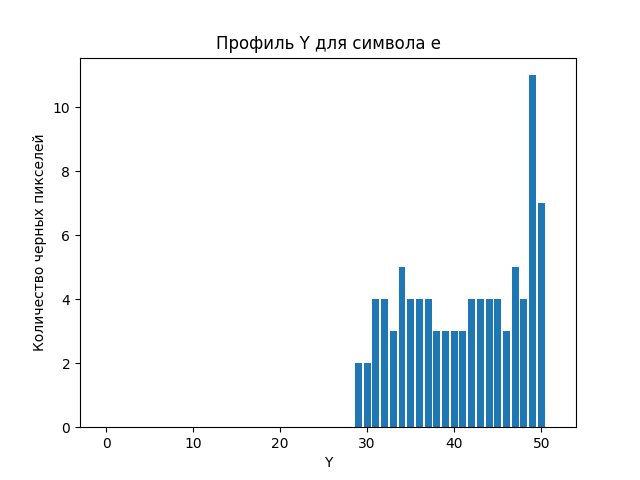

### Символ: ё

#### Изображение символа
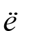

#### Профиль X
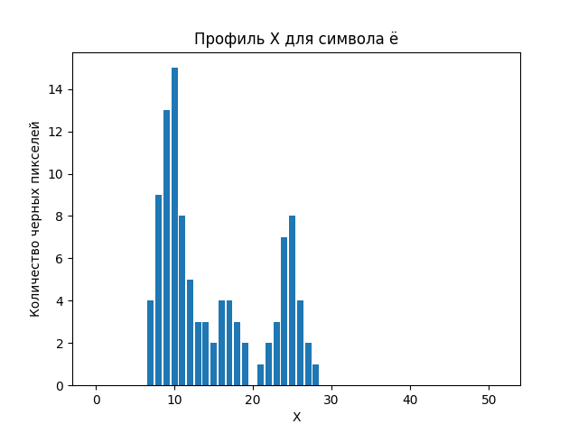

#### Профиль Y
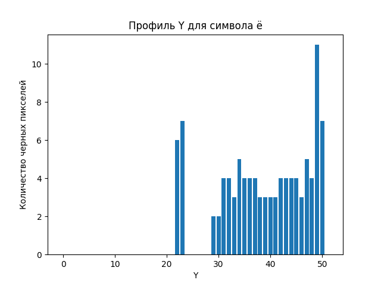

### Символ: ж

#### Изображение символа
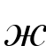

#### Профиль X
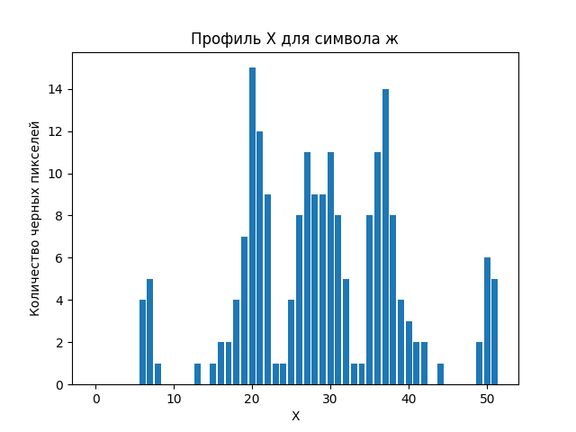

#### Профиль Y
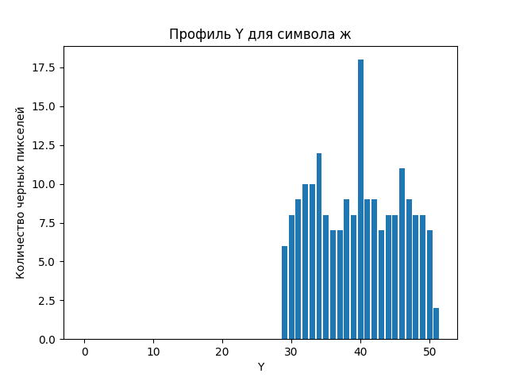

### Символ: з

#### Изображение символа
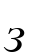

#### Профиль X
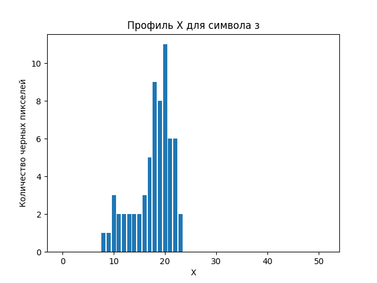

#### Профиль Y
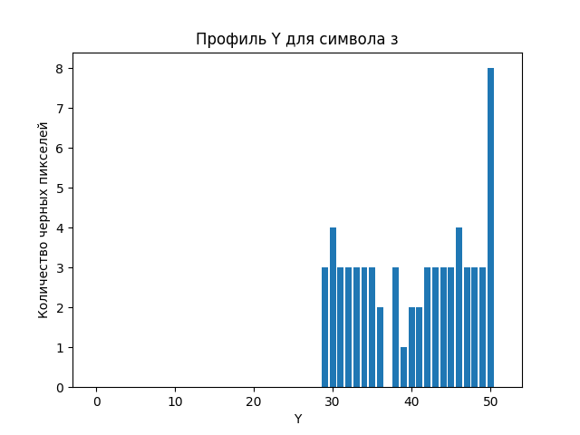

### Символ: и

#### Изображение символа
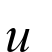

#### Профиль X
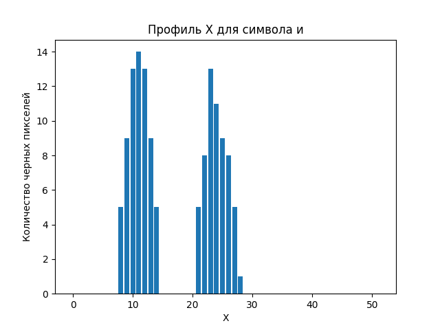

#### Профиль Y
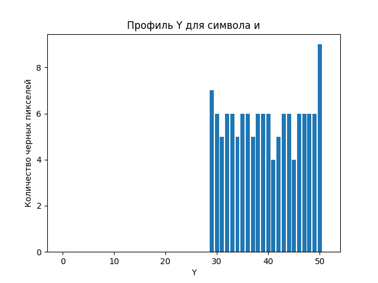

### Символ: й

#### Изображение символа
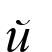

#### Профиль X
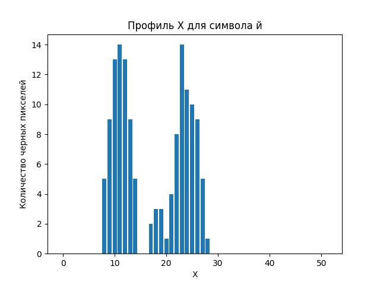

#### Профиль Y

### Символ: к

#### Изображение символа
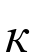

#### Профиль X
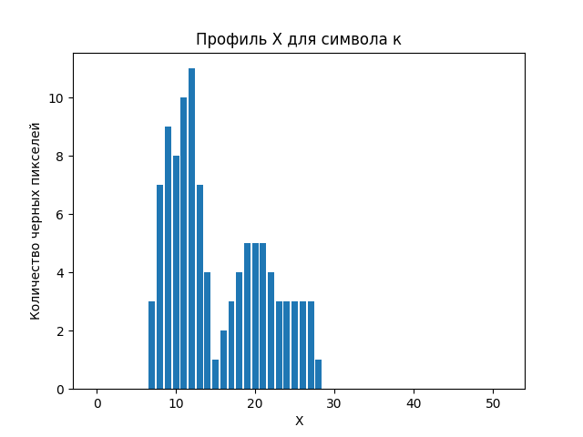

#### Профиль Y
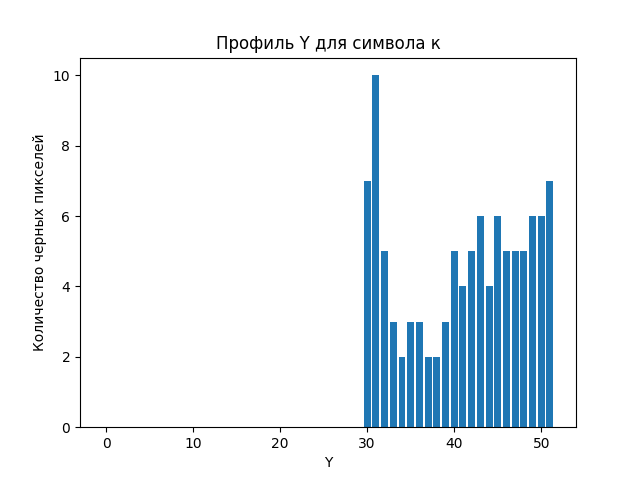

### Символ: л

#### Изображение символа
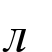

#### Профиль X
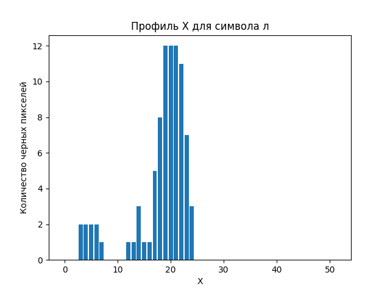

#### Профиль Y
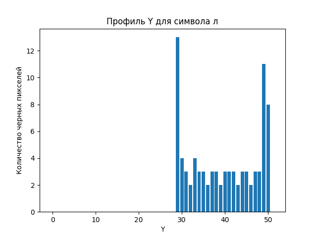

### Символ: м

#### Изображение символа
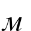

#### Профиль X
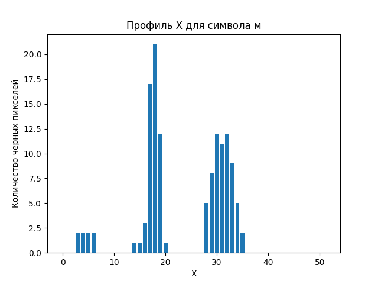

#### Профиль Y
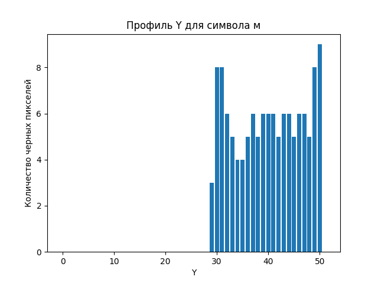

### Символ: н

#### Изображение символа
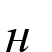

#### Профиль X
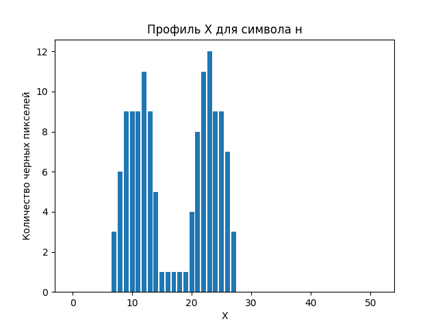

#### Профиль Y
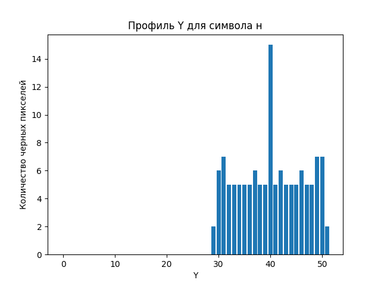

### Символ: о

#### Изображение символа
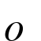

#### Профиль X
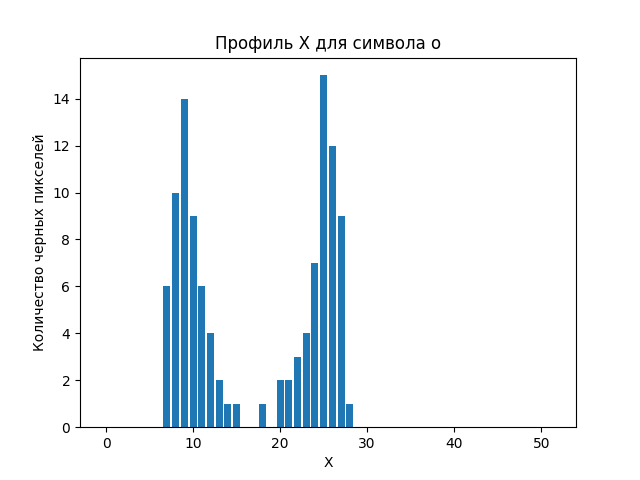

#### Профиль Y

### Символ: п

#### Изображение символа
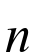

#### Профиль X
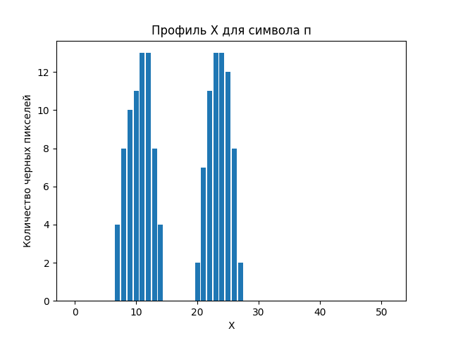

#### Профиль Y
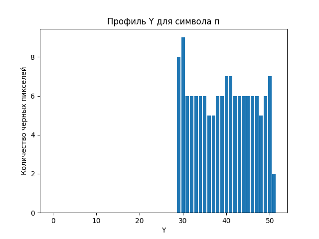

### Символ: р

#### Изображение символа
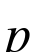

#### Профиль X

#### Профиль Y

### Символ: с

#### Изображение символа

#### Профиль X

#### Профиль Y

### Символ: т

#### Изображение символа

#### Профиль X

#### Профиль Y

### Символ: у

#### Изображение символа

#### Профиль X

#### Профиль Y

### Символ: ф

#### Изображение символа

#### Профиль X

#### Профиль Y

### Символ: х

#### Изображение символа

#### Профиль X

#### Профиль Y

### Символ: ц

#### Изображение символа

#### Профиль X

#### Профиль Y

### Символ: ч

#### Изображение символа

#### Профиль X

#### Профиль Y

### Символ: ш

#### Изображение символа

#### Профиль X

#### Профиль Y

### Символ: щ

#### Изображение символа

#### Профиль X

#### Профиль Y

### Символ: ъ

#### Изображение символа

#### Профиль X

#### Профиль Y

### Символ: ы

#### Изображение символа

#### Профиль X

#### Профиль Y

### Символ: ь

#### Изображение символа

#### Профиль X

#### Профиль Y

### Символ: э

#### Изображение символа

#### Профиль X

#### Профиль Y

### Символ: ю

#### Изображение символа

#### Профиль X

#### Профиль Y

### Символ: я

#### Изображение символа

#### Профиль X

#### Профиль Y

## Выводы
1. Все символы были успешно сгенерированы и сохранены в папку `characters`.
2. Для каждого символа были вычислены признаки и сохранены в файл `features.csv`.
3. Профили X и Y были сохранены в виде столбчатых диаграмм в папку `profiles`.
