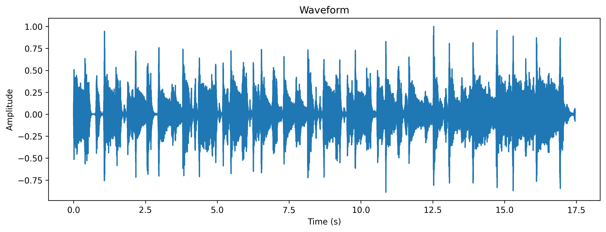
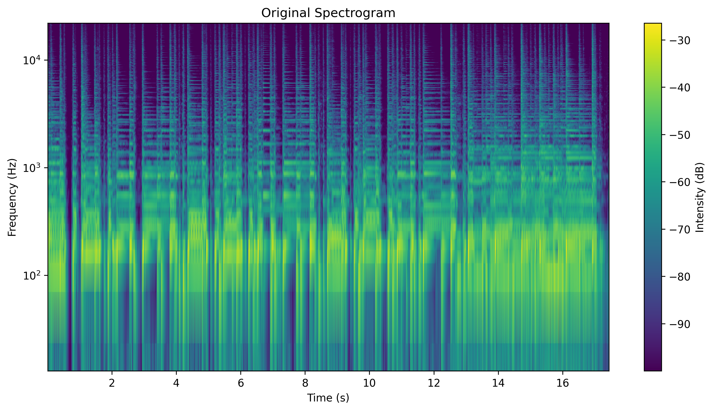
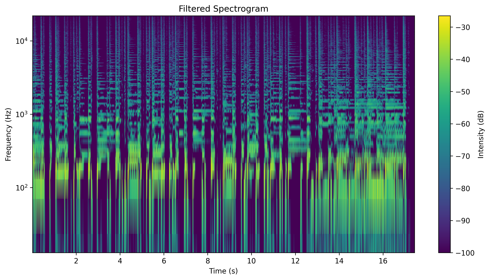

# Лабораторная работа №9: Анализ шума

## Задание 1: Запись и загрузка аудио
Анализируемый файл: `input_audio.wav`
- Частота дискретизации: 44100 Гц
- Длительность: 17.45 секунд

## Задание 2: Спектрограмма
Построена спектрограмма с использованием оконного преобразования Фурье (окно Ханна).

## Задание 3: Фильтрация шума
Применен фильтр Винера для удаления шума. Результаты сохранены в файл `filtered_audio.wav`.

Спектрограмма после фильтрации:

## Задание 4: Анализ энергии
Найдены моменты времени с максимальной энергией в диапазоне 40-50 Гц:

| Время (с) | Энергия |
|-----------|---------|
| 0.03 | 7.72e-07 |
| 0.14 | 2.55e-06 |
| 0.24 | 1.84e-07 |
| 0.39 | 8.36e-07 |
| 0.55 | 1.34e-06 |
| 0.67 | 9.20e-10 |
| 0.81 | 4.51e-06 |
| 0.94 | 3.20e-08 |
| 1.09 | 1.97e-06 |
| 1.18 | 5.01e-07 |
| 1.30 | 4.24e-07 |
| 1.47 | 4.66e-06 |
| 1.61 | 6.92e-07 |
| 1.78 | 3.85e-07 |
| 1.88 | 7.36e-06 |
| 2.03 | 2.78e-06 |
| 2.15 | 2.24e-06 |
| 2.30 | 4.49e-07 |
| 2.47 | 7.52e-08 |
| 2.60 | 2.18e-06 |
| 2.73 | 2.30e-06 |
| 2.86 | 6.58e-09 |
| 2.95 | 1.77e-06 |
| 3.13 | 3.98e-07 |
| 3.31 | 5.36e-08 |
| 3.42 | 1.52e-06 |
| 3.53 | 3.16e-06 |
| 3.62 | 1.27e-07 |
| 3.80 | 1.68e-06 |
| 3.95 | 2.89e-06 |
| 4.10 | 3.44e-06 |
| 4.24 | 1.40e-05 |
| 4.38 | 4.79e-06 |
| 4.48 | 1.00e-07 |
| 4.61 | 2.45e-07 |
| 4.81 | 3.42e-06 |
| 4.93 | 3.43e-06 |
| 5.09 | 3.16e-07 |
| 5.21 | 2.69e-06 |
| 5.34 | 9.43e-06 |
| 5.49 | 3.69e-06 |
| 5.64 | 6.84e-07 |
| 5.75 | 3.23e-06 |
| 5.87 | 4.76e-06 |
| 6.00 | 1.61e-06 |
| 6.16 | 1.94e-07 |
| 6.26 | 4.71e-06 |
| 6.43 | 4.36e-06 |
| 6.52 | 5.28e-06 |
| 6.62 | 6.83e-07 |
| 6.73 | 1.48e-07 |
| 6.85 | 1.12e-08 |
| 6.94 | 1.39e-05 |
| 7.07 | 5.65e-06 |
| 7.16 | 8.17e-07 |
| 7.33 | 3.83e-06 |
| 7.48 | 1.27e-07 |
| 7.65 | 1.42e-08 |
| 7.77 | 6.67e-06 |
| 7.88 | 5.66e-06 |
| 8.00 | 7.64e-08 |
| 8.20 | 1.57e-06 |
| 8.31 | 1.47e-06 |
| 8.43 | 1.51e-05 |
| 8.59 | 1.23e-06 |
| 8.72 | 4.36e-06 |
| 8.81 | 5.09e-07 |
| 8.99 | 3.97e-07 |
| 9.15 | 1.54e-06 |
| 9.25 | 1.64e-06 |
| 9.43 | 6.64e-08 |
| 9.54 | 3.96e-06 |
| 9.68 | 1.39e-05 |
| 9.81 | 2.99e-06 |
| 9.95 | 2.40e-07 |
| 10.04 | 2.30e-07 |
| 10.19 | 8.33e-06 |
| 10.34 | 1.61e-06 |
| 10.46 | 7.54e-09 |
| 10.58 | 4.85e-06 |
| 10.73 | 9.85e-06 |
| 10.87 | 4.46e-06 |
| 10.99 | 2.33e-06 |
| 11.15 | 8.42e-07 |
| 11.27 | 3.94e-06 |
| 11.41 | 3.51e-06 |
| 11.56 | 3.26e-06 |
| 11.71 | 1.06e-06 |
| 11.81 | 1.00e-07 |
| 11.95 | 1.99e-07 |
| 12.07 | 4.56e-08 |
| 12.25 | 8.04e-06 |
| 12.35 | 7.34e-08 |
| 12.54 | 3.24e-06 |
| 12.65 | 6.72e-07 |
| 12.75 | 4.25e-06 |
| 12.93 | 7.22e-06 |
| 13.08 | 1.50e-06 |
| 13.22 | 7.41e-07 |
| 13.35 | 1.61e-06 |
| 13.51 | 6.21e-06 |
| 13.63 | 5.78e-06 |
| 13.79 | 6.43e-06 |
| 13.90 | 7.11e-06 |
| 14.00 | 1.07e-06 |
| 14.19 | 1.74e-06 |
| 14.32 | 2.51e-06 |
| 14.44 | 1.22e-05 |
| 14.56 | 8.42e-07 |
| 14.73 | 8.02e-06 |
| 14.88 | 4.83e-06 |
| 15.03 | 4.98e-06 |
| 15.15 | 8.72e-06 |
| 15.24 | 1.25e-06 |
| 15.39 | 1.74e-06 |
| 15.58 | 4.75e-06 |
| 15.74 | 4.63e-06 |
| 15.87 | 5.37e-06 |
| 16.01 | 6.79e-06 |
| 16.13 | 6.11e-06 |
| 16.27 | 8.01e-07 |
| 16.40 | 9.92e-07 |
| 16.52 | 1.52e-06 |
| 16.66 | 4.13e-06 |
| 16.83 | 4.82e-07 |
| 16.93 | 2.91e-06 |
| 17.03 | 7.83e-07 |
| 17.23 | 9.38e-07 |
| 17.39 | 5.19e-08 |

## Выводы
1. Успешно построены графики звуковой волны и спектрограммы до и после фильтрации.
2. Реализована оценка уровня шума и применен фильтр Винера.
3. Обнаружены моменты времени с максимальной энергией в заданном частотном диапазоне.
4. Фильтрация позволила уменьшить уровень шума, что видно на спектрограмме.
